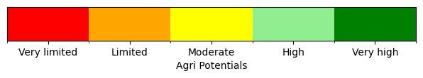
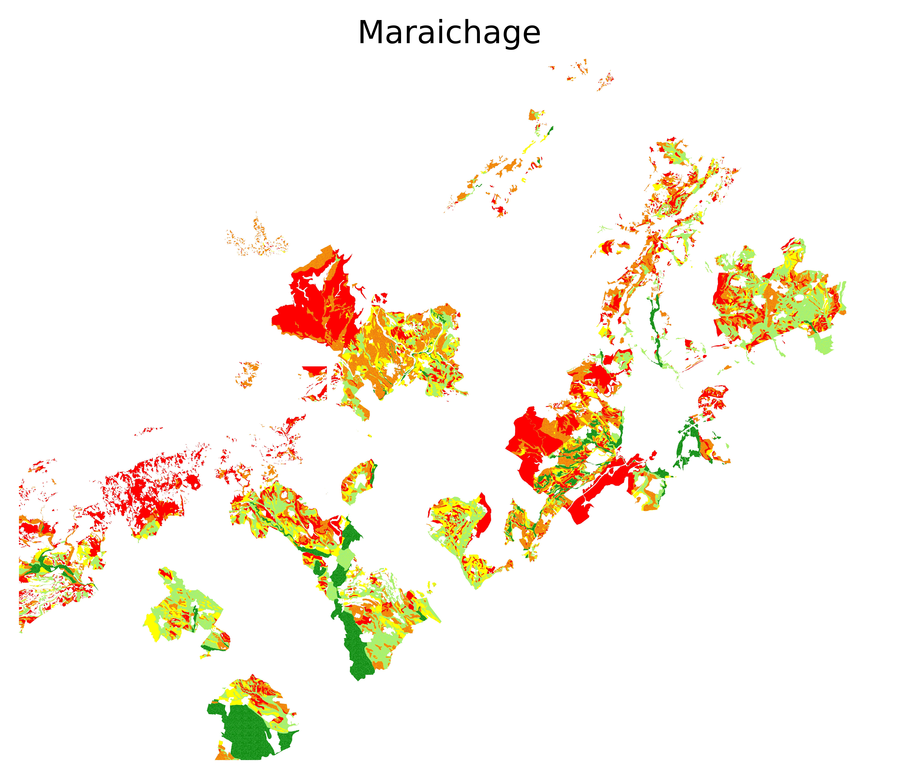
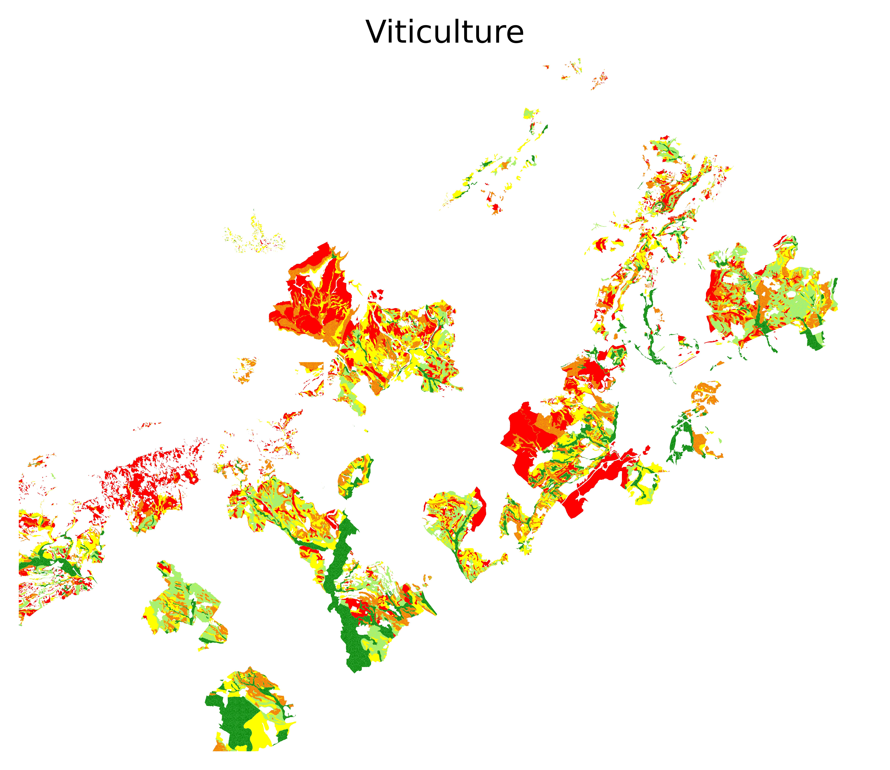
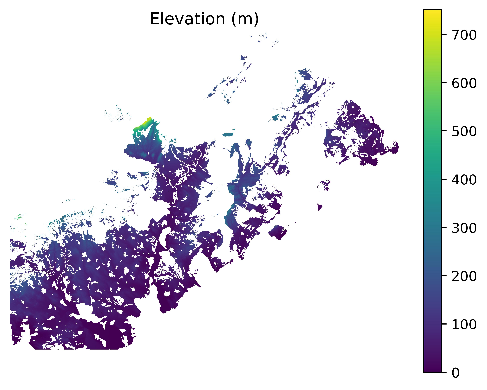

# Agricultural Potential Dataset

Agricultural potential refers to the capacity of a specific area to produce crops. This potential is influenced by environmental factors such as soil quality and climate. This repository proposes a remote sensing multimodal multisource and multitemporal dataset built for supervised AI.

# Input features
Input features include data collected in 2019 that consists of:
- Monthly multispectral Sentinel-2 images 
- Elevation data 
- Weather data (10-day frequency):
    - Temperature (Avg, Min, Max) in °C
    - Precipitation (mm)

# Output labels
The potentiality of 3 types of plantations:
- Market gardening (fr: maraîchages)
- Viticulture
- Field crops (fr: grandes cultures)

The potential has 5 levels ranging from very limited to very high.

# Data visualization


## Potentials
### Potential Levels

### Market Gardening

### Viticulture

### Field Crops


## Elevation

## Sentinel-2
### Color Image

### False Color Image

### Temperature (Avg) in °C

### Temperature (Max) in °C

### Temperature (Min) in °C

### Precipitation (mm)


# Creating Python virtual environment for Jupyter Notebook

## On Linux 

```
python3 -m venv myenv
source myenv/bin/activate
pip install jupyter
pip install ipykernel
python -m ipykernel install --user --name=myenv --display-name "Python (myenv)"
pip install -r requirements.txt
jupyter notebook
```
