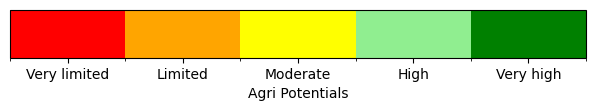
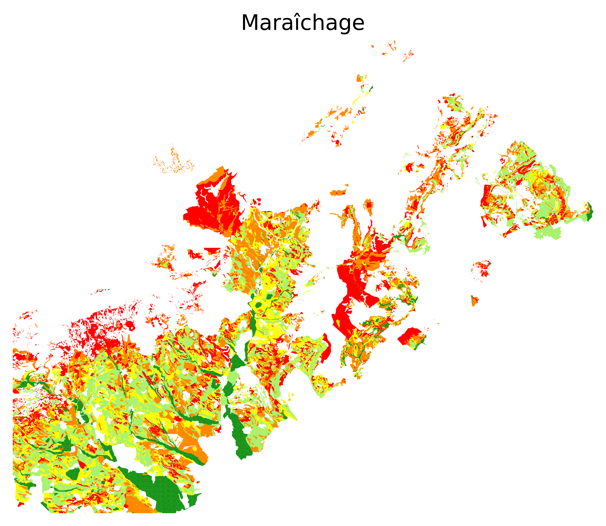
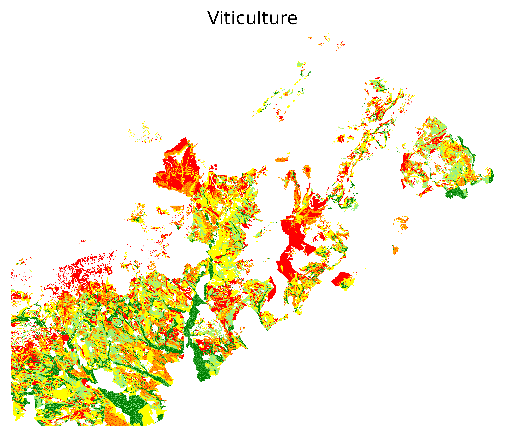
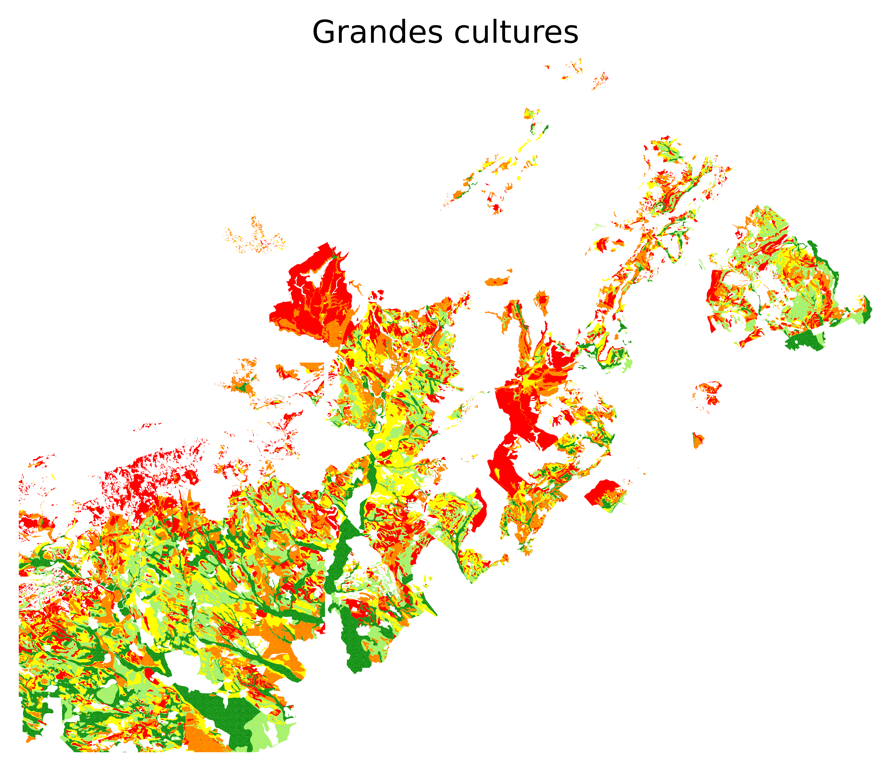

# Agricultural Potential Dataset

Agricultural potential refers to the capacity of a specific area to produce crops. This potential is influenced by environmental factors such as soil quality and climate. This repository proposes a remote sensing multimodal multisource and multitemporal dataset built for supervised AI. This repository contains the code needed to construct the dataset from raw files. However, the ready-to-use dataset is made available using the following command:
```
python3 main.py dataset
```
A jupyter notebook is provided as a tutorial to understand the dataset structure in ```notebooks/tutorial.ipynb```
Click [here](#venv) for the guide to install required libraries

# Input features
Input features include data collected in 2019 that consists of:
- Monthly multispectral Sentinel-2 images 
- Elevation data 
- Weather data (10-day frequency):
    - Temperature (Avg, Min, Max) in °C
    - Precipitation (mm)

# Output labels
The potentiality of 3 types of plantations:
- Market gardening (fr: maraîchages)
- Viticulture
- Field crops (fr: grandes cultures)

The potential has 5 levels ranging from very limited to very high.

<!-- # Data visualization


## Potentials
### Potential Levels

### Market Gardening

### Viticulture

### Field Crops


## Elevation

## Sentinel-2
### Color Image

### False Color Image

### Temperature (Avg) in °C

### Temperature (Max) in °C

### Temperature (Min) in °C

### Precipitation (mm)
 -->

# Creating Python virtual environment {#venv}

## On Linux 

```
python3 -m venv agri_venv
source agri_venv/bin/activate
pip install jupyter
pip install ipykernel
python -m ipykernel install --user --name=agri_venv --display-name "Python (agri_venv)"
pip install -r requirements.txt
```
